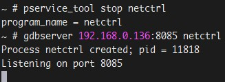
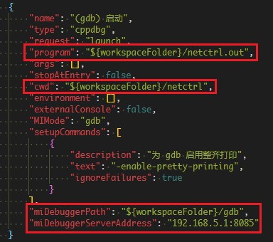
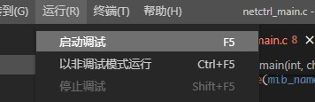
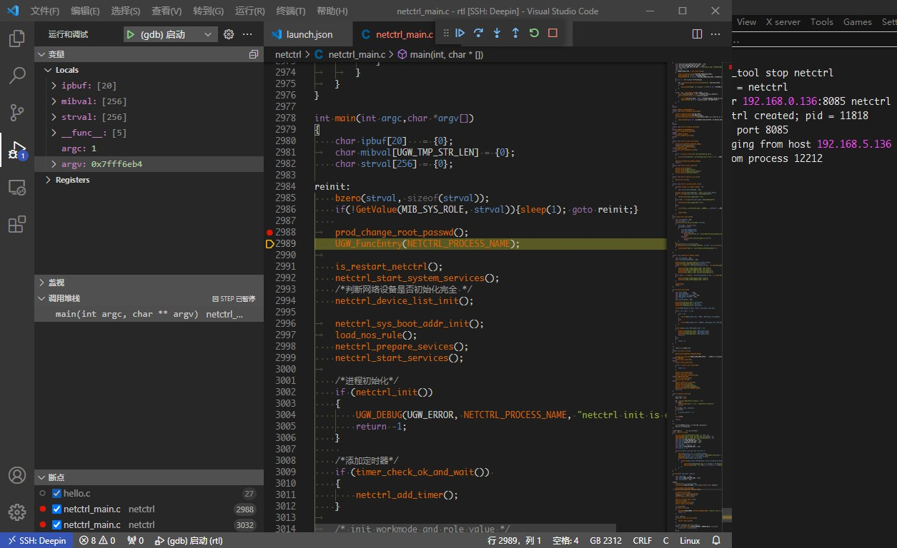

# GDB在线调试方法

## 1. 获取GDB源码

为防止交叉编译工具自带的gdb和gdbserver需要额外运行库而加大搭建调试环境的难度，使用gdb源码编译生成gdb和gdbserver进行调试；为避免交叉编译工具不支持 *C++11* 标准而导致编译报错，因此选择较老的版本，建议选择 **gdb-7.12.1** 版本。
[gdb源码下载地址](http://ftp.gnu.org/gnu/gdb/)

## 2. 编译GDB

为方便编译可将交叉编译工具路径添加到临时环境变量中,例：

```bash
export PATH=/projects/hnd/tools/rtl/msdk-4.4.7-mips-EL-3.10-u0.9.33-m32t-140827/bin/:$PATH
```

进入到 `gdb-7.12.1` 目录下，使用对应平台的交叉编译工具在源码根目录下执行交叉编译gdb并安装：

```bash
./configure --target=mips-linux --prefix=/home/lichenglong/gdbtest/install
make
make install
```

编译生成的gdb可执行文件在配置的install目录下。

## 3. 编译GDB server

进入到 `gdb/gdbserver` 目录下，执行交叉编译gdbserver：

```bash
./configure --target=mips-linux --host=mips-linux --prefix=/home/lichenglong/gdbtest/install
make
make install
```

编译生成的gdbserver在配置的install目录下。

**可能遇到的问题：**

编译 `linux-mips-low.c` 报错 MMLO 宏未定义，使用 `grep -r MMLO *` 命令查找宏在何处定义，发现是在其上级目录的 `mips-linux-tdep.h` 中定义，添加头文件包含后编译即可通过。

## 4. 使用GDB进行调试

### 4.1 运行GDB server

将gdbserver和要调试的可执行文件放到目标平台上(nfs、tftp)，执行命令运行：

```bash
./gdbserver ip:port 目标文件
```

如果要调试的进程会由 `monitor` 自动拉起，需要先让其停止运行，再使用gdbserver拉起。



**可能遇到的问题：**

运行gdbserver报错缺少运行库，如： libstdc++.so.6 。  
使用命令 `readelf -d gdbserver | grep NEEDED` 显示gdbserver运行所依赖的库：

```bash
[~/gdbtest/gdb-7.12.1/gdb/gdbserver]$ readelf -d gdbserver| grep NEEDED
 0x00000001 (NEEDED)                     Shared library: [libdl.so.0]
 0x00000001 (NEEDED)                     Shared library: [libstdc++.so.6]
 0x00000001 (NEEDED)                     Shared library: [libm.so.0]
 0x00000001 (NEEDED)                     Shared library: [libgcc_s.so.1]
 0x00000001 (NEEDED)                     Shared library: [libc.so.0]
```

在目标平台上查找必要的依赖库是否存在，若不存在则可以在交叉编译工具中查找相应的库文件，然后添加到目标平台中。

### 4.2 VSCode启动调试

在linux环境下运行VSCode（或者使用ssh远程连接）， **确保VSCode所在的环境与目标平台能互相ping通** ，配置好 `launch.json` ，要使用目标平台上gdbserver配套的gdb进行调试。



点击 `启动调试` ，即可连接到目标平台运行程序。



建议先在代码中打上 **断点** ，避免开始调试后直接就运行过了需要调试的代码部分。



**可能遇到的问题：**

程序直接运行完，断点不生效，可能是编译程序的时候没有加 **-g** 参数。

## 5. 调试问题处理

1. GDB无法加载源码

   * 使用gdb打开目标文件，输入 `l` ，如果打印 `No symbol table is loaded. Use the “file” command.` ， 则说明目标文件没有调试信息，需要增加 `-g` 编译选项重新编译(可在 `makefile.common` 的 `CFLAGS` 后添加)。如果加了 `-g` 仍然没有调试信息，注意看看Makefile中有没有加 `strip` 命令及其对应的宏，该命令会去掉可执行文件中的调试信息。

   * 使用命令 `readelf 目标文件 -p .debug_str` ，会打印出源码路径：

     ```bash
     $ readelf netctrl.out -p .debug_str
     String dump of section '.debug_str':
     [     0]  swan_num
     [     9]  sin6_family
     [    15]  MULTIWAN_IE_BUTT
     [    26]  WLAN_5G_2
     ......
     [   939]  /work/lichenglong/MESH-ITB01/prod/agent/netctrl
     ......
     [  c185]  upgrade_default_cfg
     [  c199]  key_byte
     [  c1a2]  crypt_decrypt_rc4
     [  c1b4]  key_data
     ```

     在 `launch.json` 修改源码路径，如 [launch.json](#42-vscode启动调试) 所示。

2. 博通方案启动调试异常

   VSCode启动调试报错：

   ```text
   Loaded 'target:/lib/ld-linux.so.3'. Symbols loaded.
   ERROR: Unable to start debugging. Unrecognized format of field "level" in result: {level=-1,addr=0xb6fceb00,func=_start,args=[],from=target:/lib/ld-linux.so.3}
   The program '/home/licl/Desktop/bcm/a.out' has exited with code 42 (0x0000002a).
   ```

    命令行运行gdb报错：

   ```text
   Remote 'g' packet reply is too long: 00000000000000000000000000000000000000000000000000000000000000000000000000000000000000000000000000000000b0feffbe0000000000ebfcb61000000000000000000000000000000000000000000000000000000000000000000000000000000000000000000000000000000000000000000000000000000000000000000000000000000000000000000000000000000000000000000000000000000000000000000000000000000000000000000000000000000000000000000000000000000000000000000000000000000000000000000000000000000000000000000000000000000000000000000000000000000000000000000000000000000000000000000000000000000000000000000000000000000000000000000000000000000000000000000000000000000000000000000000000000000000000000000000000xb6fceb00 in _start () from target:/lib/ld-linux.so.3
   ```

    解决办法：

    通过搜索，原因是gdb在远程调试时，因为寄存器大小的切换，导致gdb出现的bug。修改gdb源码 `remote.c`，重新编译gdb即可解决，修改内容如下所示：

   ```patch
   /* Further sanity checks, with knowledge of the architecture.  */
   -  if (buf_len > 2 * rsa->sizeof_g_packet)
   -    error (_("Remote 'g' packet reply is too long: %s"), rs->buf);
   +  //if (buf_len > 2 * rsa->sizeof_g_packet)
   +  //  error (_("Remote 'g' packet reply is too long: %s"), rs->buf);
   +
   +    if(buf_len > 2 * rsa->sizeof_g_packet) {
   +        rsa->sizeof_g_packet = buf_len;
   +        for(i = 0; i < gdbarch_num_regs(gdbarch); i++){
   +            if(rsa->regs->pnum == -1)
   +               continue;
   +            if(rsa->regs->offset >= rsa->sizeof_g_packet)
   +               rsa->regs->in_g_packet = 0;
   +            else
   +               rsa->regs->in_g_packet = 1;
   +        }
   +    }
   ```
