# 一、IPv6动态寻址

IPv6动态寻址有三种方式：无状态地址自动配置(SLAAC)、无状态DHCPv6、有状态DHCPv6。

其中有无状态是指IP地址能否被统一管理，例如：有状态DHCPv6指IP地址由DHCPv6服务器分配，网络管理员能通过DHCPv6服务对IP地址进行统一管理。

# 二、RA/RS消息

RA/RS分别是路由通告消息和路由请求消息的缩写，这两个消息类型是ICMPv6邻居发现协议定义的。

## 2.1 RA路由通告消息

RA消息由IPv6路由器向多播地址`ff02::1`发送，目的是宣布自身存在以及向消息发送接口所连链路有关的IPv6地址信息和配置参数，如：链路的IPv6前缀、前缀长度、默认网关的地址、链路最大传输单元(MTU)。

通常的IPv6路由器会定时向链路发送路由通告消息，如果收到设备发送的RS消息，也会立即发送RA消息。

### 2.1.1 A、O、M标志位

RA消息中可携带三种标志位，向IPv6设备建议如何创建或获取地址。

- A标志位（地址自动配置标记）

  该标志位出现在RA消息的Option中的Prefix Information里。当该标志位打开(置1)时，表示建议主机采用SLAAC方式来创建地址，采用RA消息中的前缀加上接口ID生成地址。

- O标志位（其他配置标记）

  该标志位出现在RA消息主体里。当该标志位打开(置1)时，表示建议主机采用SLAAC方式来创建地址，通过DHCPv6服务器获取除地址以外的其他地址信息，如：DNS服务器的IP地址和域名。

- M标志位（管理地址配置标记）

  该标志位出现在RA消息主体里。当该标志位打开(置1)时，表示建议主机从DHCPv6服务器获取地址及所有其他地址信息，只从RA消息中获取IPv6网关地址。

  | M    | O    | A    | IP地址                       | 其他配置 |
  | ---- | ---- | ---- | ---------------------------- | -------- |
  | 0    | 0    | 0    | 静态设置                     | 手工配置 |
  | 0    | 0    | 1    | 前缀由 RA 指定，自动生成     | 手工配置 |
  | 0    | 1    | 0    | 静态设置                     | DHCPv6   |
  | 0    | 1    | 1    | 前缀由 RA 指定，自动生成     | DHCPv6   |
  | 1    | 0    | 0    | 有状态 DHCPv6                | DHCPv6   |
  | 1    | 0    | 1    | 有状态 DHCPv6 和/或 自动生成 | DHCPv6   |
  | 1    | 1    | 0    | 有状态 DHCPv6                | DHCPv6   |
  | 1    | 1    | 1    | 有状态 DHCPv6 和/或 自动生成 | DHCPv6   |

## 2.2 RS路由恳求消息

RS消息由IPv6设备向多播地址`ff02::2`发送，源地址是设备的本地链路地址(LLA)或IPv6未指定地址(::)，目的是向IPv6路由器请求链路地址相关的信息。

# 三、无状态地址自动配置(SLAAC)

以下是SLAAC配置地址的流程：

1. 客户端接口启动成功后，向`ff02::2`发送RS消息。

   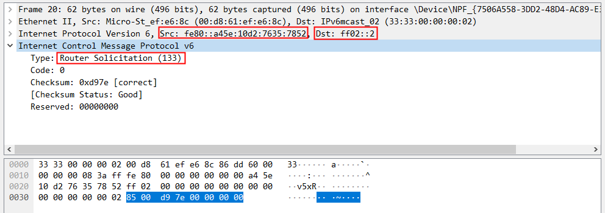

   源地址为客户端的本地链路地址(LLA)，目的地址是代表所有IPv6路由器的多播地址。

2. IPv6路由器接收到RS消息后，立即向`ff02::1`或客户端LLA发送RA消息。

   因为采用SLAAC自动生成地址，所以RA消息中的A标志位置1，O和M标志位置0。

   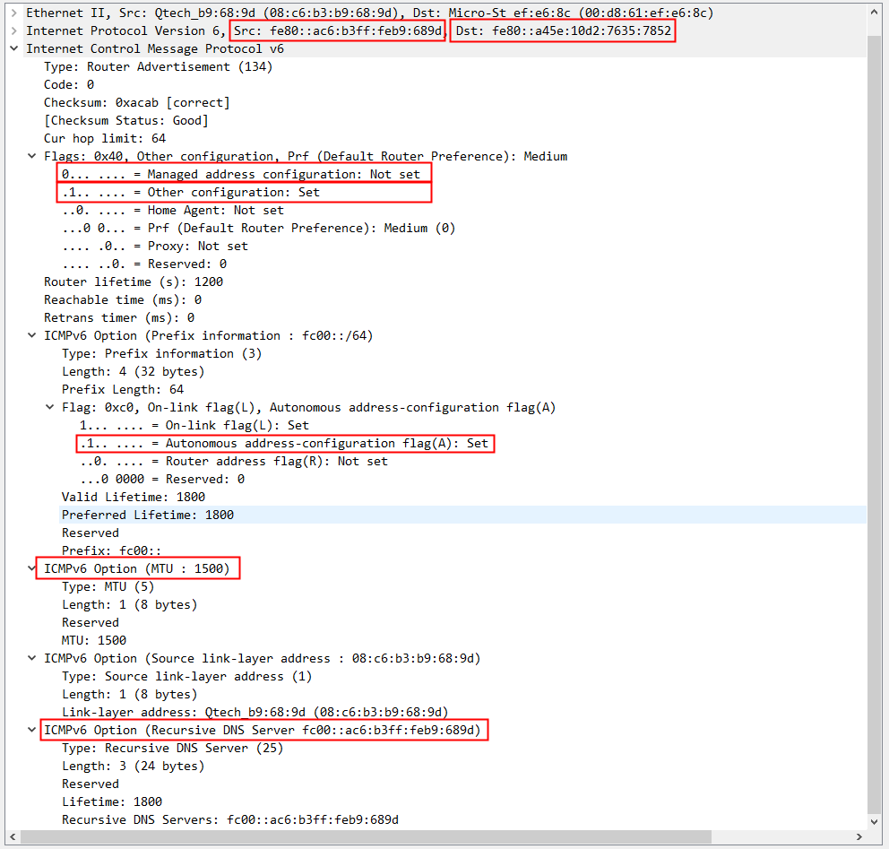

   源地址为IPv6路由器的本地链路地址，目的地址是客户端的本地链路地址，M标志位为0，O标志位为1（M20-8G和AC5客供软件在设置为SLAAC模式后，RA消息中O标志位都置为1，暂不清楚原因）。

   在选项中可以看到：A标志位为1，表示建议客户端自动生成地址；当前链路的MTU位1500；DNS服务器为`fc00::ac6:b3ff:feb9:689d`

3. 客户端使用RA报文中的前缀和接口ID生成IP地址。

   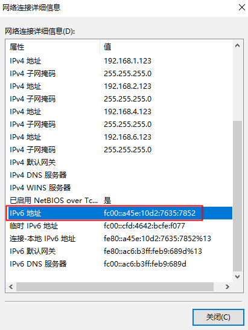

# 四、无状态DHCPv6

无状态DHCPv6的地址配置过程与SLAAC类似，但增加了与DHCP服务器交互的过程。以下是无状态DHCPv6配置地址的流程：

1. 客户端接口启动成功后，向`ff02::2`发送RS消息。

   

   源地址为客户端的本地链路地址(LLA)，目的地址是代表所有IPv6路由器的多播地址。

2. IPv6路由器接收到RS消息后，立即向`ff02::1`或客户端LLA发送RA消息。

   因为采用SLAAC自动生成地址，所以RA消息中的A和O标志位置1，M标志位置0。

   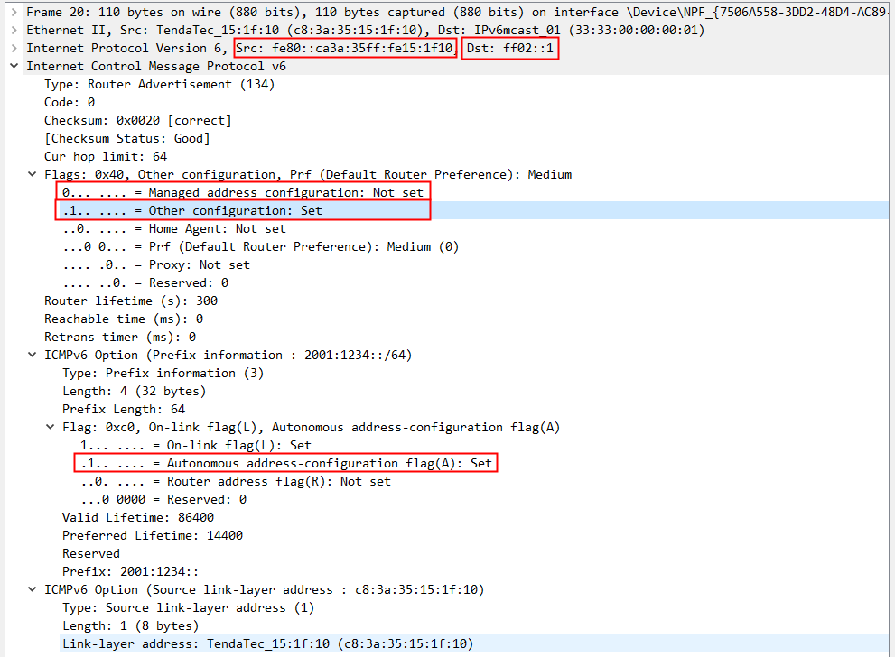

   源地址为IPv6路由器的本地链路地址，目的地址是代表所有IPv6客户端的多播地址，M标志位为0，O标志位为1。

   在选项中可以看到：A标志位为1，表示建议客户端自动生成地址。

3. 客户端使用RA报文中的前缀和接口ID生成IP地址。

   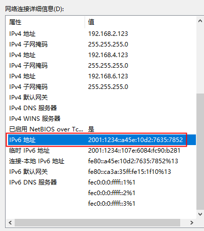

4. 客户端发送DHCPv6恳求消息寻找DHCPv6服务器。

   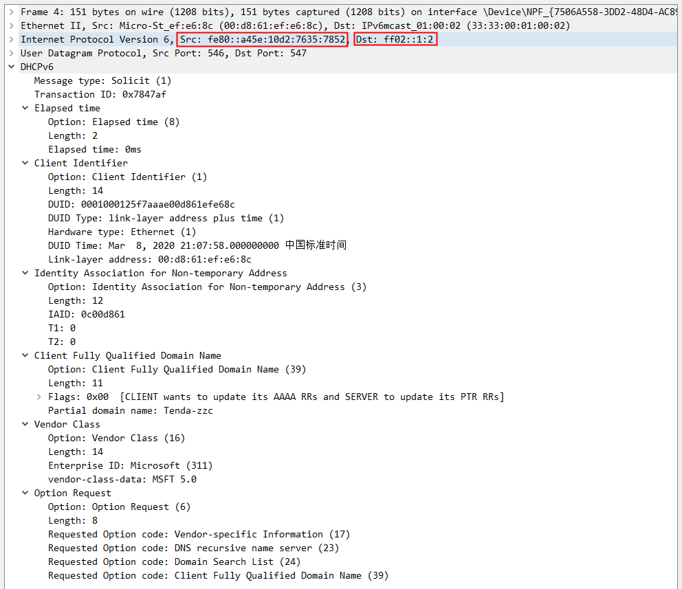

   源地址为客户端本地链路地址，目的地址为代表所有DHCPv6服务器和中继服务器的多播地址`ff02::1:2`，目的是定位DHCPv6服务器。

5. DHCPv6服务器回应请求，发送DHCPv6通告消息。

   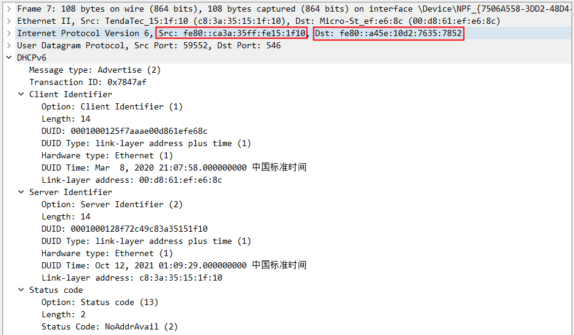

   DHCPv6服务器发送通告消息，源地址是DHCPv6服务器本地链路地址，目的地址是客户端的本地链路地址。

6. 客户端发送DHCPv6信息请求消息。

   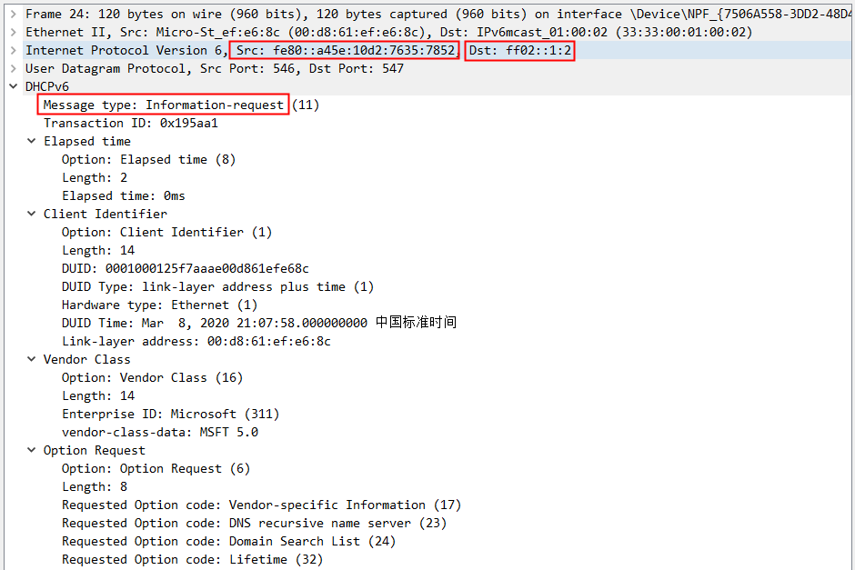

   客户端再发送信息请求消息，请求从DHCPv6服务器获取地址参数（不是地址）。

7. DHCPv6服务器回应请求，发送DHCPv6应答消息。

   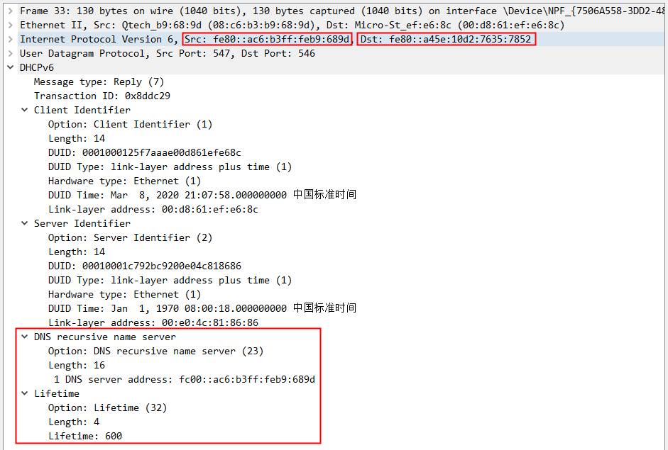

   DHCPv6服务器发送应答消息，其中包含地址参数，如图：DNS服务器地址。

# 五、有状态DHCPv6

有状态DHCPv6地址分配方式即除了IPv6网关信息外，其他所有地址信息都从DHCPv6服务器获取，以下是有状态DHCPv6配置地址的流程：

1. 客户端接口启动成功后，向`ff02::2`发送RS消息。

  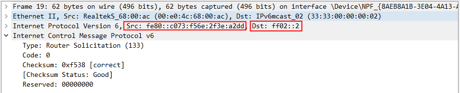

  源地址是客户端本地链路地址，目的地址是`ff02::2`所有IPv6路由器。

2. IPv6路由器接收到RS消息后，立即向`ff02::1`或客户端LLA发送RA消息。

  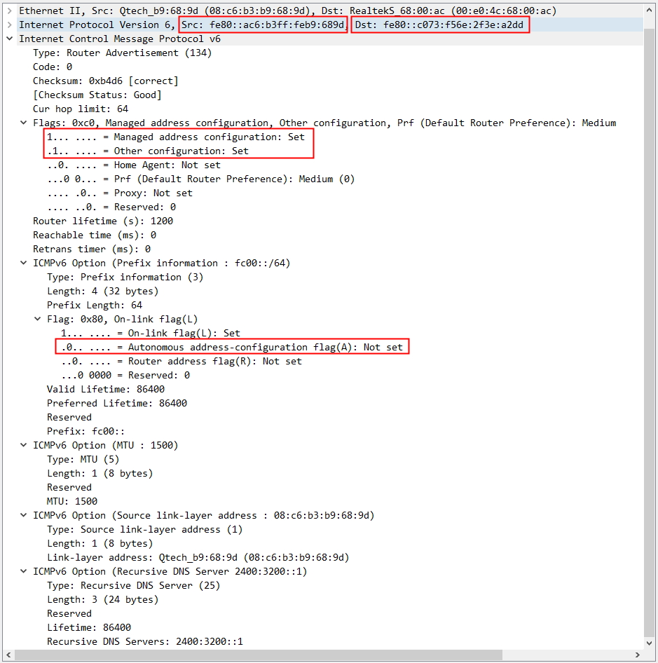

  由于是有状态DHCPv6，A标志位置0，O和M标志位置1。表示建议客户端从DHCPv6服务器获取地址和地址配置。

3. 客户端使用RA报文中的IPv6网关地址。

   客户端从RA报文中只采用IPv6网关地址，其他信息从DHCPv6服务器获取。

4. 客户端发送DHCPv6恳求消息寻找DHCPv6服务器。

  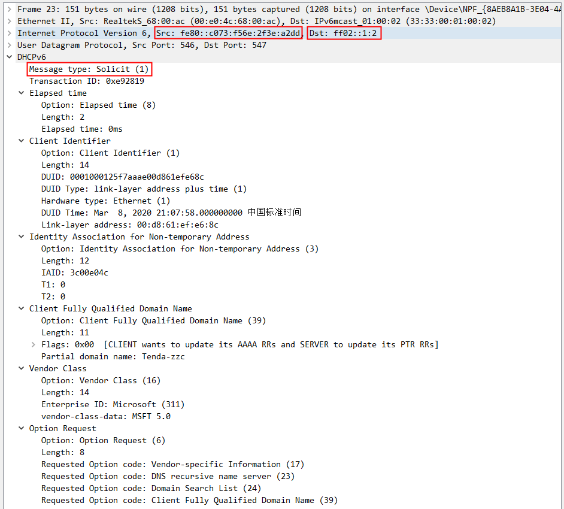

  `ff02::1:2`表示所有DHCPv6服务器和中继服务器。

5. DHCPv6服务器回应请求，发送DHCPv6通告消息。

  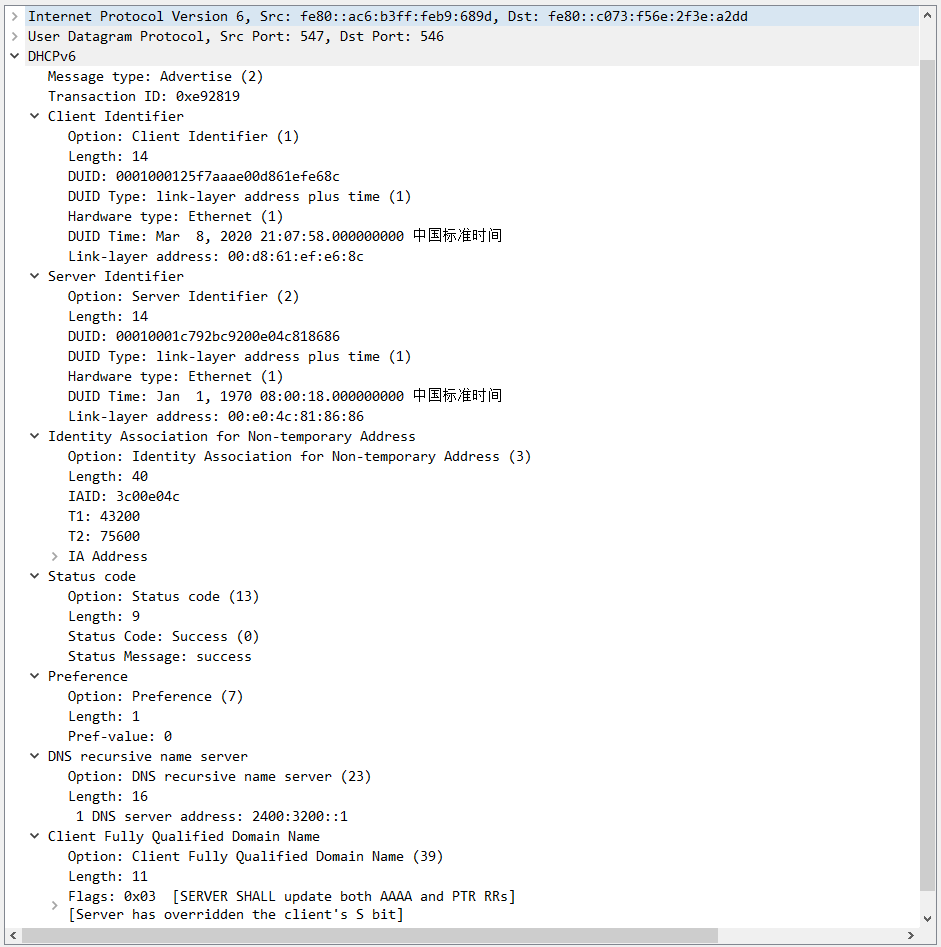

6. 客户端发送DHCPv6信息请求消息。

  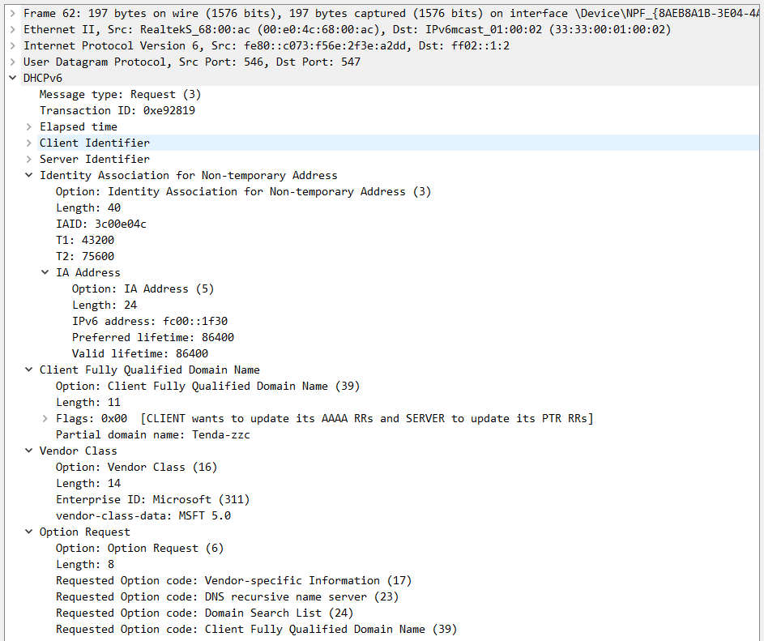

7. DHCPv6服务器回应请求，发送DHCPv6应答消息。

   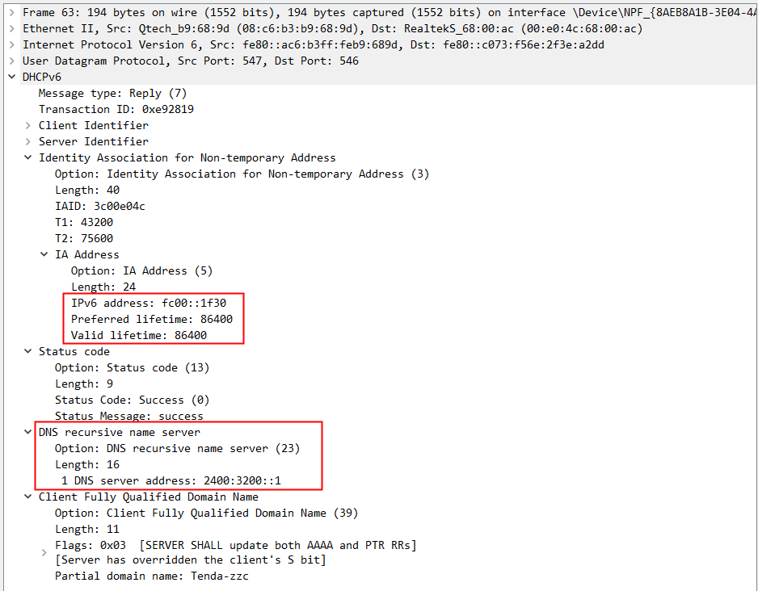

  在回应消息中，DHCPv6服务器提供了IP地址及其他的配置信息，如图：DNS服务器地址

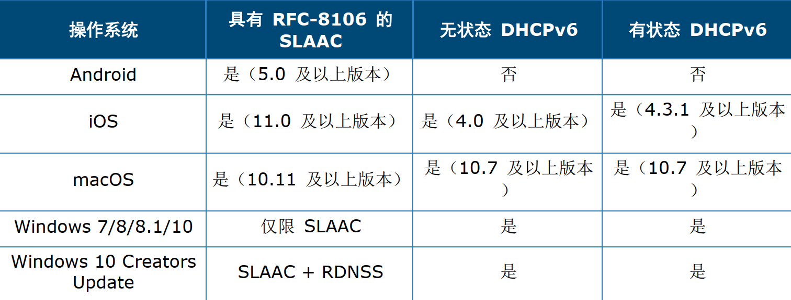

> [IPv6动态地址分配机制详解](https://www.packetmania.net/2020/12/01/IPv6-Addressing/)
>
> [DHCPv6基础](https://cshihong.github.io/2018/02/01/DHCPv6%E5%9F%BA%E7%A1%80/)
