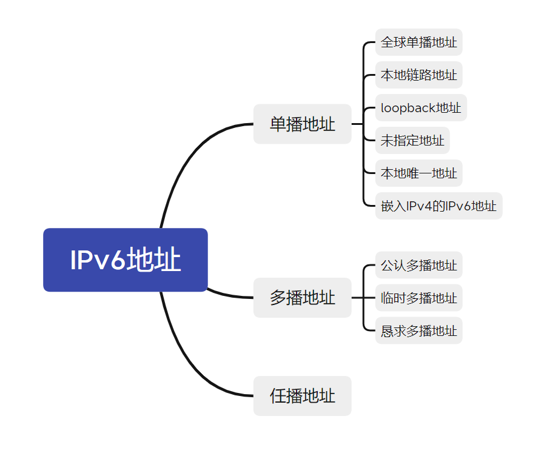
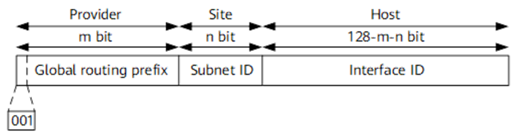
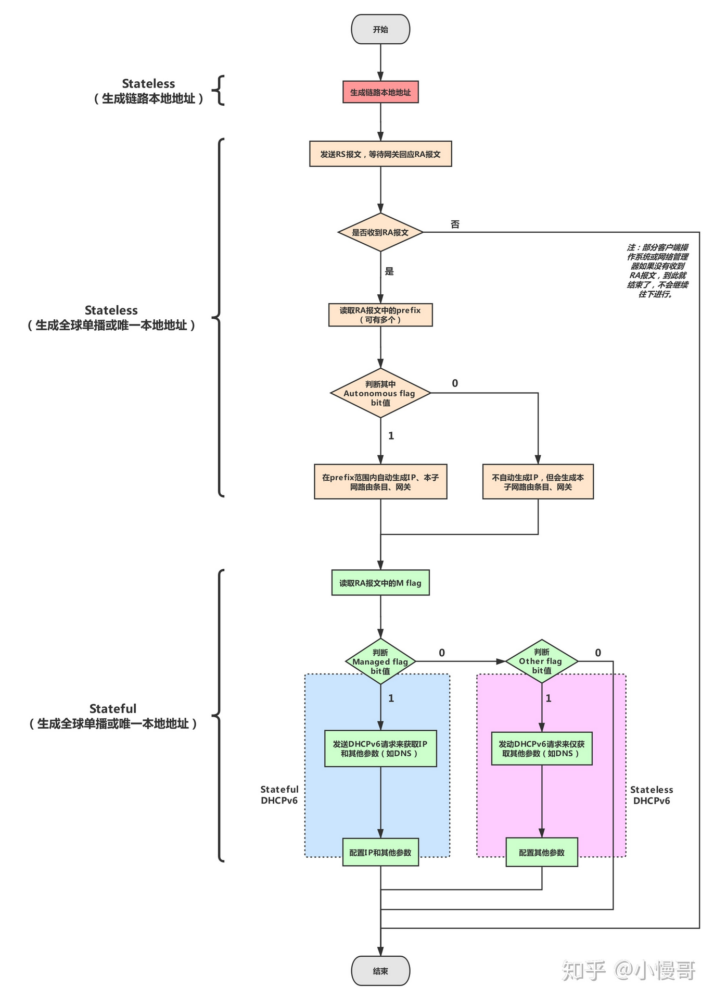
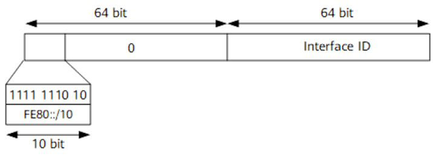
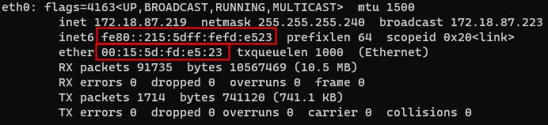
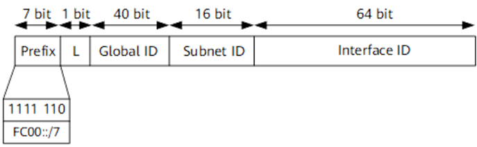

# IPv6入门

## 1. 特点

网际协议第6版(Internet Protocol version 6)是网际协议的最新版本，用它来取代IPv4，解决IPv4地址枯竭的问题。它在很多方面对于IPv4进行了改进。

* IPv6采用128位标志，可提供近乎无限的地址空间。
* IPv6去除了IPv4中不常用的标志头，且提出了扩展头的概念，使报文得到简化，降低了性能消耗。
* IPv6支持通过地址自动配置方式使主机自动发现网络并获取IPv6地址。
* IPv6网络层支持IPsec认证和加密，支持端到端的安全。
* IPv6增加了流标志域，提供了QOS支持。
* IPv6优化了对移动设备的支持。

## 2. 对比IPv4

* 采用128位长度，可提供近乎无限的地址
* 优化了报头，性能更优，且具有扩展性
* 主机可自主发现网络并配置IP地址，可不依赖DHCP服务
* 地址空间巨大可进行更合理的层次化网络部署，以方便进行路由聚合，提高路由转发效率
* 网络层支持IPSec，实现端到端的安全
* 增加了流标志域，提供Qos保障，可区分实时流量，不同的流标签+源地址可以唯一确定一条数据流，中间网络设备可以根据这些信息更加高效率的区分数据流。
* 对移动网络优化，邻居发现和可扩展报头解决了IPv4的三角路由、源地址过滤问题

## 3. 地址

### 3.1 地址格式

IPv6采用128位来标志，16位为一组，用":"隔开，分为8组，每组用4位十六进制数表示。

一个IPv6的地址可以分为两个部分：

1. 网络前缀：n位，类似IPv4中的网络ID
2. 接口标识：128-n位，类似IPv4中的主机ID

同时IPv6在某些条件下可以省略：

1. 每项数字前导的0可以省略，省略后前导数字仍是0则继续，例如下组IPv6是等价的。
   * 2001:**0**db8:**0**2de:**0000**:**0000**:**0000**:**0000**:**0**e13
   * 2001:db8:2de:**0000**:**0000**:**0000**:**0000**:e13
   * 2001:db8:2de:**000**:**000**:**000**:**000**:e13
   * 2001:db8:2de:**00**:**00**:**00**:**00**:e13
   * 2001:db8:2de:**0**:**0**:**0**:**0**:e13
2. 可以用双冒号“::”表示一组0或多组连续的0，但只能出现一次：
   1. 如果四组数字都是零，可以被省略。遵照以上省略规则，下面这两组IPv6都是相等的。

      * 2001:db8:2de:**0**:**0**:**0**:**0**:e13

      * 2001:db8:2de**::**e13

      * 2001:0db8:**0000**:**0000**:**0000**:**0000**:1428:57ab

      * 2001:0db8:**0000**:**0000**:**0000**::1428:57ab

      * 2001:0db8:**0**:**0**:**0**:**0**:1428:57ab

      * 2001:0db8:**0**::**0**:1428:57ab

      * 2001:0db8**::**1428:57ab

   2. 2001**::**25de**::**cade 是非法的，因为双冒号出现了两次。它有可能是下种情形之一，造成无法推断。

      * 2001:0000:0000:0000:0000:25de:0000:cade
      * 2001:0000:0000:0000:25de:0000:0000:cade
      * 2001:0000:0000:25de:0000:0000:0000:cade
      * 2001:0000:25de:0000:0000:0000:0000:cade

   3. 如果这个地址实际上是IPv4的地址，后32位可以用10进制数表示；因此::ffff:192.168.89.9 相等于::ffff:c0a8:5909。

### 3.2 分类

#### 3.2.1 全球单播地址

全球单播地址(GUA，Global Unicast Addresses )是带有全球单播前缀的IPv6地址，地址空间为2000::/3，其作用类似于IPv4中的公网地址。
全球单播地址由全球路由前缀（Global routing prefix）、子网ID（Subnet ID）和接口标识（Interface ID）组成：

* Global routing prefix：全球路由前缀。由提供商（Provider）指定给一个组织机构，通常全球路由前缀至少为48位。目前已经分配的全球路由前缀的前3bit均为001。
* Subnet ID：子网ID。组织机构可以用子网ID来构建本地网络（Site）。子网ID通常最多分配到第64位。子网ID和IPv4中的子网号作用相似。
* Interface ID：接口标识。用来标识一个设备（Host）。

##### 单播地址配置

有无状态仅针对IPv6地址分配，不包含其他参数。

* 有状态：地址可控，可管理，可实现类似IPv4 DHCP申请租约、续租的功能。
* 无状态：地址不可控，难管理，网络中只有网关，每个客户端发送RA报文(邻居发现协议)自行配置地址。

除了手动配置外，还可以采用自动配置（默认认为接口已自动生成链路本地地址）。自动配置分为以下几种方式：

* 无状态

  发送RS报文，根据网关回应的RA报文(邻居发现协议)中的前缀自动配置地址（前缀+EUI-64或随机）

* 无状态DHCPv6

  地址依然通过RA、RS报文生成。其他参数如DNS，从DHCPv6服务器获取。

* 有状态DHCPv6

  地址、DNS等信息都从DHCPv6服务器获取。

#### 3.2.2 链路本地地址

链路本地地址(LLA，Link-Local Addresses)是IPv6中的应用范围受限制的地址类型，具有以下特点：

* 只能在连接到同一本地网络的设备之间使用；

* 设备采用地址冲突检测机制来保证该地址在本地网络中的唯一性；

* 设备每个接口有且仅有一个链路本地地址；

* 目的地址为链路本地地址的数据包将不会被路由；

* 链路本地地址的前缀为`FE80::/10`，同时将接口标识添加在后面作为地址的低64比特。

##### 链路本地地址配置

###### EUI-64规则

1. 在48位MAC地址中间插入16位固定值FFFE。

2. 把第7位取反。

3. 加上前缀。

###### EUI-48规则

 直接在48位MAC地址加上前缀，现已弃用。

#### 3.2.3 本地唯一地址

本地唯一地址(ULA:Unique Local Address)是另一种应用范围受限的地址，它仅能在一个站点内使用。由于本地站点地址的废除（RFC3879），唯一本地地址被用来代替本地站点地址。这类地址划分成两个/8组： `fc00::/8`保留尚未定义，`fd00::/8`可以使用，具体使用时可以随机生成40位的前缀，与/8一起组成48位前缀，后面还是一样，16位子网+64位接口地址。

唯一本地地址的作用类似于IPv4中的私网地址`10.0.0.0/8`、`172.16.0.0/12`和`192.168.0.0/16`，任何没有申请到提供商分配的全球单播地址的组织机构都可以使用唯一本地地址。唯一本地地址只能在本地网络内部被路由转发而不会在全球网络中被路由转发。

> 设有ULA的设备既不能访问Internet，也不能被Internet上的设备访问。——《IPv6技术精要》4.4.5

#### 3.2.4 回环地址

`::1/128`－是一种单播绕回地址。如果一个应用程序将数据包送到此地址，IPv6堆栈会转送这些数据包绕回到同样的虚拟接口（相当于IPv4中的`127.0.0.1/8`）。

#### 3.2.5 未指定地址

`::/128`－所有比特皆为零的地址称作未指定地址。

* 这个地址不可指定给某个网络接口；
* 数据包源地址为未指定地址时，表示源设备接口的IPv6地址暂缺；
* 路由器不可转发包含未指定地址的数据包；
* 未指定地址会用于IMCPv6冲突地址检测机制中，作为某些ICMPv6消息的源地址。

#### 3.2.6 嵌入IPv4的IPv6地址

双栈设备可使用嵌入IPv4的IPv6地址与IPv4和IPv6网络进行交互。这类地址的前80位全部置0，接下来的16位全部置1，最后32位填充IPv4地址，可用点分十进制来表示。例如：

* 0000:0000:0000:0000:0000:ffff:206.123.31.2
* 0000:0000:0000:0000:0000:ffff:ce7b:1f01
* 0:0:0:0:0:ffff:ce7b:1f01
* ::ffff:ce7b:1f01

### 3.3 GUA/ULA/LLA对比

GUA：Global Unicast Addresses全球单播地址

* 一个接口可有多个全球单播地址
* 在获取全球单播地址前，必须生成链路本地地址

ULA：Unique Local Address本地唯一地址

* 使用方式类似于GUA，在网络合并或私自互联时，不会发生地址冲突问题，也无须重编址(地址空间巨大，冲突可能性极小)
* 设有ULA的设备不能访问Internet，也不能被Internet上其他设备访问
* 用于仅在本地工作的设备，例如：打印机、门铃、开关等

LLA：Link-Local Addresses链路本地地址

* 每个支持IPv6协议的接口有且仅有唯一一个链路本地地址，采用地址冲突检测机制保证在**链路本地**的唯一性(多个接口在不同链路中可以使用相同的链路本地地址)
* 目的地址为链路本地地址的数据包将不会被路由，即仅在本网段内生效
