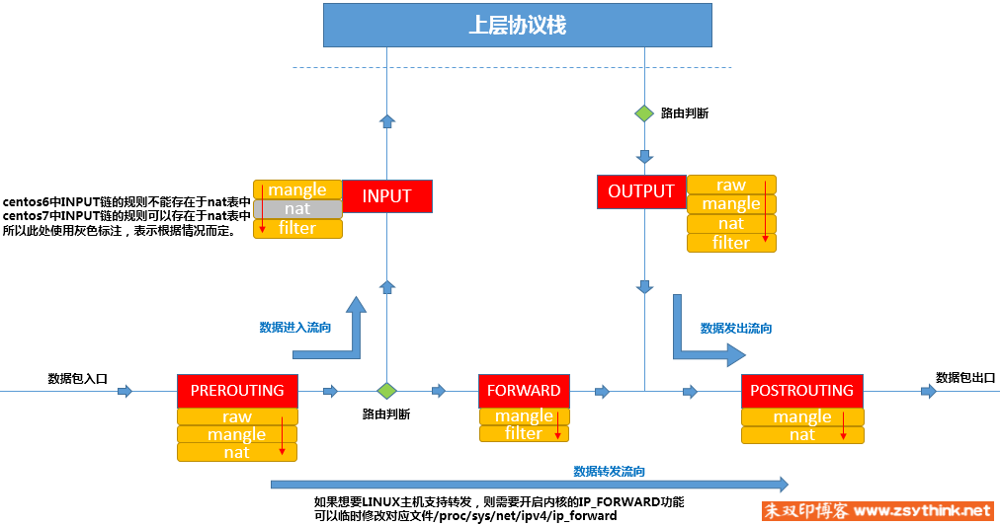
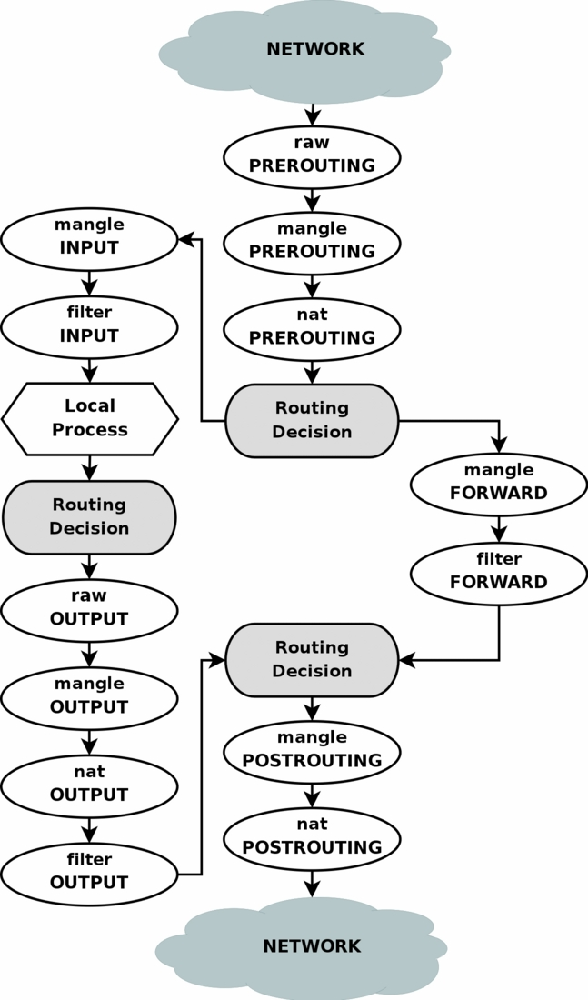
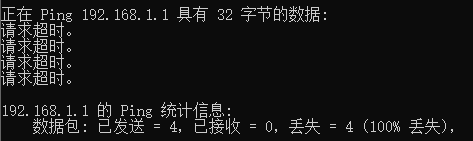
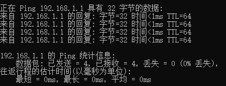

## 一、iptables

iptables是运行在用户空间的软件，通过控制内核中的netfilter模块来实现对网络的管理。实际上我们只是通过iptables来对内核中的netfilter的规则进行修改，netfilter才是实际工作的模块。

通常来说iptables仅用于处理IPv4数据包，对于IPv6需要使用ip6tables命令。

## 二、netfilter

netfilter是在linux内核中的一个软件框架，用于管理网络数据包。有：网络地址转换、数据包修改、数据包过滤、防火墙等功能。

我们可以使用用户空间中的iptables、nftables、ebtables和arptables等软件来控制netfilter，进而管理通过本系统的数据包。

## 三、基础

iptables根据规则来对数据包进行管理，一条规则包含：动作、源地址、目的地址、协议等信息。

协议可以查看```/etc/protocols/```中定义的协议类型，可使用名字(不区分大小写)、对应编号。缺省值为0，代表tcp、udp、icmp而不是定义的所有协议类型。

### 1.五链


五链就是指图中的：prerouting、input、forward、postrouting、output五种数据包动作。
例如：

1. 到本机某进程的数据包：prerouting、input
2. 进过本机转发的数据包：prerouting、forward、postrouting
3. 本机发出的数据包：output、postrouting

### 2.四表

iptables把功能相似的规则放在同一张表中，默认为我们创建了四张表：

* filter：过滤数据包。内核模块：iptables_filter
* nat：网络地址转换。内核模块：iptable_nat
* mangle：拆解、修改、重新发送数据包。内核模块：iptable_mangle
* raw：决定数据包是否被状态跟踪机制处理。内核模块：iptable_raw

### 3.链和表的关系

不同表能作用的链的关系如表：

| 四表/五链 | PREROUTING | INPUT      | FORWARD | OUTPUT | POSTROUTING |
| --------- | ---------- | ---------- | ------- | ------ | ----------- |
| filter    |            | √          | √       | √      |             |
| nat       | √          | √(centos7) |         | √      | √           |
| mangle    | √          | √          | √       | √      | √           |
| raw       | √          |            |         | √      |             |

表的优先级关系：raw > mangle > nat > filter，raw的最高。





## 四、规则

规则是根据指定的匹配条件来尝试匹配每个流经此处的报文，一旦匹配成功，则由规则后面指定的处理动作进行处理。

### 1. 匹配条件

匹配条件分为基本匹配条件与扩展匹配条件：

* 基本匹配条件：
  源地址Source IP，目标地址 Destination IP
  上述内容都可以作为基本匹配条件。
* 扩展匹配条件：
  除了上述的条件可以用于匹配，还有很多其他的条件可以用于匹配，这些条件泛称为扩展条件，这些扩展条件其实也是netfilter中的一部分，只是以模块的形式存在，如果想要使用这些条件，则需要依赖对应的扩展模块。

下面仅列出常用的简单匹配规则。

#### 1.1 IP地址匹配

我们可以使用```-s```和```-d```指定匹配源IP和目的IP，还可以使用```!```来表示取反，多个规则时使用```,```号隔开。例如：

```shell
# 单个匹配
iptables -I INPUT -s 1.1.1.2 -j DROP

# 多个匹配
iptables -I INPUT -s 1.1.1.3,1.1.1.4 -j DROP

# 网段匹配
iptables -I INPUT -s 1.1.1.5/23 -j DROP

# 取反匹配
iptables -I INPUT ! -s 1.1.1.6 -j ACCEPT

# 源和目的IP匹配
iptables -I INPUT -s 1.1.1.7 -d 1.1.1.8 -j DROP
```

#### 1.2 协议匹配

我们可以使用```-p```指定匹配的协议，可使用协议名称(不区分大小写)，或对应编号。支持协议可查看```/etc/protocols```中的内容，也可以查看相关[RFC文档定义的协议和对应编号](https://www.iana.org/assignments/protocol-numbers/protocol-numbers.xhtml)。

在指定IP地址匹配的同时可指定具体协议，例如：

```shell
# 不响应指定源IP的ping数据包
iptables -I INPUT -s 1.1.1.2 -p icmp -j DROP
```

#### 1.3 接口匹配

我们还可以使用```-i```和```-o```参数根据流入和流出的接口来匹配。```-i```匹配流入的网卡，作用于PREROUTING、INPUT、FORWARD；```-o```匹配流出的网卡，作用于FORWARD、OUTPUT、POSTROUTING。

#### 1.4 端口匹配

端口匹配属于扩展匹配条件，需要依赖扩展模块。

1. 单端口匹配

   单端口匹配依赖tcp扩展模块，使用```-m tcp```指定扩展模块，然后使用```--dport```指定目的端口；```--sport```指定源端口。以```22:55```的形式指定端口范围。例如：

   ```shell
   # 丢弃来自1.1.1.2的tcp协议且目的端口是22的数据包
   iptables -I INPUT -s 1.1.1.2 -p tcp -m tcp --dport 22 -j DROP
   ```

2. 多端口匹配

   多端口匹配适用于同时指定多个离散的端口，需要依赖multiport扩展模块。例如：

   ```shell
   iptables -I INPUT -s 1.1.1.2 -p tcp -m multiport --dports 22,36,80 -j DROP
   ```

### 2. 处理动作

处理动作在iptables中被称为target（这样说并不准确，我们暂且这样称呼），动作也可以分为基本动作和扩展动作。
此处列出一些常用的动作，之后的文章会对它们进行详细的示例与总结：

* ACCEPT：允许数据包通过。

* DROP：直接丢弃数据包，不给任何回应信息，这时候客户端会感觉自己的请求泥牛入海了，过了超时时间才会有反应。

* REJECT：拒绝数据包通过，必要时会给数据发送端一个响应的信息，客户端刚请求就会收到拒绝的信息。

  可附加`–reject-with`参数，指定拒绝对方时的响应类型，缺省为icmp-port-unreachable。可指定的类型有：icmp-net-unreachable、icmp-host-unreachable、icmp-port-unreachable、icmp-proto-unreachable、icmp-net-prohibited、icmp-host-pro-hibited、icmp-admin-prohibited。

* SNAT：源地址转换，解决内网用户用同一个公网地址上网的问题。

* MASQUERADE：是SNAT的一种特殊形式，适用于动态的、临时会变的ip上。

* DNAT：目标地址转换。

* REDIRECT：在本机做端口映射。

* LOG：在/var/log/messages文件中记录日志信息，然后将数据包传递给下一条规则，也就是说除了记录以外不对数据包做任何其他操作，仍然让下一条规则去匹配。

补充一下DROP和REJECT的区别。DROP是直接把匹配到的报文丢弃，REJECT除了把报文丢弃还会给该报文中的源IP发一个ICMP报文说明目的不可达(直接回复不可达, 更强硬)。前者报文发送方只能等超时，而后者发送方因为收到了ICMP不可达所以马上就给出了提示。

## 五、命令使用

```shell
~ # iptables -h
iptables v1.4.21

Usage: iptables -[ACD] chain rule-specification [options]
       iptables -I chain [rulenum] rule-specification [options]
       iptables -R chain rulenum rule-specification [options]
       iptables -D chain rulenum [options]
       iptables -[LS] [chain [rulenum]] [options]
       iptables -[FZ] [chain] [options]
       iptables -[NX] chain
       iptables -E old-chain-name new-chain-name
       iptables -P chain target [options]
       iptables -h (print this help information)

Commands:
Either long or short options are allowed.
  --append  -A chain Append to chain
  --check   -C chain  Check for the existence of a rule
  --delete  -D chain  Delete matching rule from chain
  --delete  -D chain rulenum
        Delete rule rulenum (1 = first) from chain
  --insert  -I chain [rulenum]
        Insert in chain as rulenum (default 1=first)
  --replace -R chain rulenum
        Replace rule rulenum (1 = first) in chain
  --list    -L [chain [rulenum]]
        List the rules in a chain or all chains
  --list-rules -S [chain [rulenum]]
        Print the rules in a chain or all chains
  --flush   -F [chain]    Delete all rules in  chain or all chains
  --zero    -Z [chain [rulenum]]
        Zero counters in chain or all chains
  --new     -N chain    Create a new user-defined chain
  --delete-chain
            -X [chain]    Delete a user-defined chain
  --policy  -P chain target
        Change policy on chain to target
  --rename-chain
            -E old-chain new-chain
        Change chain name, (moving any references)
Options:
    --ipv4  -4    Nothing (line is ignored by ip6tables-restore)
    --ipv6  -6    Error (line is ignored by iptables-restore)
[!] --protocol  -p proto  protocol: by number or name, eg. `tcp'
[!] --source  -s address[/mask][...]
        source specification
[!] --destination -d address[/mask][...]
        destination specification
[!] --in-interface -i input name[+]
        network interface name ([+] for wildcard)
 --jump -j target
        target for rule (may load target extension)
  --goto      -g chain
                              jump to chain with no return
  --match -m match
        extended match (may load extension)
  --numeric -n    numeric output of addresses and ports
[!] --out-interface -o output name[+]
        network interface name ([+] for wildcard)
  --table -t table  table to manipulate (default: `filter')
  --verbose -v    verbose mode
  --wait  -w    wait for the xtables lock
  --line-numbers    print line numbers when listing
  --exact -x    expand numbers (display exact values)
[!] --fragment  -f    match second or further fragments only
  --modprobe=<command>    try to insert modules using this command
  --set-counters PKTS BYTES set the counter during insert/append
[!] --version -V    print package version.
```

## 六、filter表实践

filter是负责数据包过滤的表，是我们最常用的表。

首先查看filter表中原有的规则：

```shell
~ # iptables -t filter -nvL --line
Chain INPUT (policy ACCEPT 6214 packets, 569K bytes)
num   pkts bytes target     prot opt in     out     source               destination         
1     9889 1160K ACCEPT     all  --  eth0.1 *       0.0.0.0/0            0.0.0.0/0            state RELATED,ESTABLISHED
2        5   320 DROP       icmp --  eth0.1 *       0.0.0.0/0            0.0.0.0/0            icmptype 8
3     7007  630K access_ctrl  all  --  *      *       0.0.0.0/0            0.0.0.0/0           
4      522 34807 DROP       all  --  eth0.1 *       0.0.0.0/0            0.0.0.0/0           

Chain FORWARD (policy ACCEPT 26932 packets, 6125K bytes)
num   pkts bytes target     prot opt in     out     source               destination         

Chain OUTPUT (policy ACCEPT 32373 packets, 8525K bytes)
num   pkts bytes target     prot opt in     out     source               destination         
1     1354 83951 dns_drop   udp  --  *      *       0.0.0.0/0            0.0.0.0/0            udp dpt:53 state NEW

Chain access_ctrl (1 references)
num   pkts bytes target     prot opt in     out     source               destination         
1        0     0 ACCEPT     icmp --  eth0.1 *       0.0.0.0/0            0.0.0.0/0           
2        0     0 ACCEPT     tcp  --  eth0.1 *       0.0.0.0/0            0.0.0.0/0            tcp dpt:1723
3        0     0 ACCEPT     udp  --  eth0.1 *       0.0.0.0/0            0.0.0.0/0            udp dpt:1701
4        0     0 ACCEPT     41   --  eth0.1 *       0.0.0.0/0            0.0.0.0/0           

Chain dns_drop (1 references)
num   pkts bytes target     prot opt in     out     source               destination         
```

添加不响应测试主机ping的规则：

```shell
~ # iptables -I INPUT -s 192.168.1.141 -p icmp -j DROP
```

测试：



删除规则：

```shell
~ # iptables -L INPUT --line
Chain INPUT (policy ACCEPT)
num  target     prot opt source               destination         
1    DROP       icmp --  192.168.1.141        anywhere            
2    ACCEPT     all  --  anywhere             anywhere             state RELATED,ESTABLISHED
3    DROP       icmp --  anywhere             anywhere             icmp echo-request
4    access_ctrl  all  --  anywhere             anywhere            
5    DROP       all  --  anywhere             anywhere            
~ # iptables -D INPUT 1
```

再次测试：



